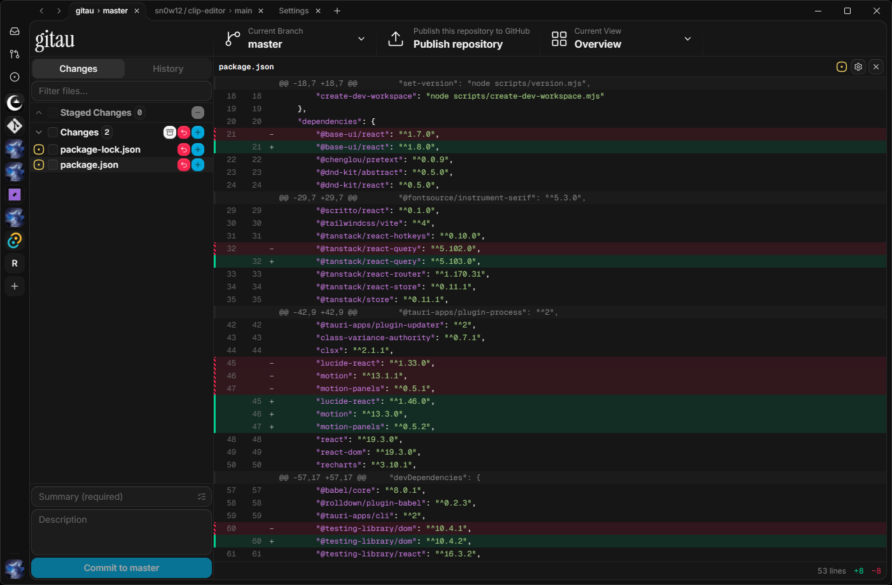

# gitau

A cross-platform Git desktop client.



## Install

Download the installer for your platform from the GitHub [Releases page](https://github.com/sn0w12/gitau/releases/latest).

## Development

### Requirements

- Node LTS
- Rust 1.85+
- The platform dependencies from the [Tauri prerequisites guide](https://tauri.app/start/prerequisites/).

### Commands

```bash
npm install
npm run tauri dev            # desktop app with hot reload
npm run tauri build          # installer bundle
```

Run the full gate set before opening a pull request:

```bash
npm run format:check
npm run lint
npm run typecheck
npm test
cargo fmt --all --check
cargo check --workspace --all-targets
cargo clippy --workspace --all-targets -- -D warnings
cargo test --workspace
```

After changing the Rust settings schema, regenerate the frontend settings
contract:

```bash
cargo run -p gitau --bin export_settings
```
